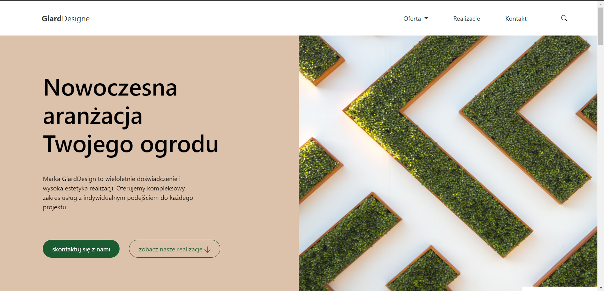

# Business Card Design of a Gardening Company - README



This is a README for the Horticultural Business Card project, which uses HTML, CSS, JavaScript and Bootstrap framework. The project includes animations and presents a business card of a gardening company.

# Preview

https://giarddesigne.netlify.app/

# Prerequisites

Before you start working on your project, make sure you have the following tools installed:

Node. js version 14 or later
npm (installed with Node. js)
Git

# Installation

Clone this repository on your computer:

```bash
git clone https://github.com/Arekk17/giarddesigne
```

Go to the project directory:

```bash
cd nazwa_katalogu_projektu
```

Install dependencies using npm:

```bash
npm install
```

Launching
To start the project, follow these steps:

In the project directory, run the command:

```bash
npm run dev
```

Open your browser and go to http://localhost:3000 (or another one if you use a different port).

## Project structure:

Description of the structure of directories and files in the project.

- index. html - Main HTML file of the project.
- node_modules/ - Directory with npm dependencies.
- script/ - Directory contains all scripts
- styles/ - Catalog contains all styles
- assets/ - Directory containing static files, such as images, icons, etc.
- Other source files (depending on project needs)

# Using Bootstrap

The project uses the Bootstrap framework for responsive design and styling. See Bootstrap for more information.

# Using Macy.js

this project includes macy js to store photo galleries

# Graphic design

The graphic design was made by **adRespect**.
